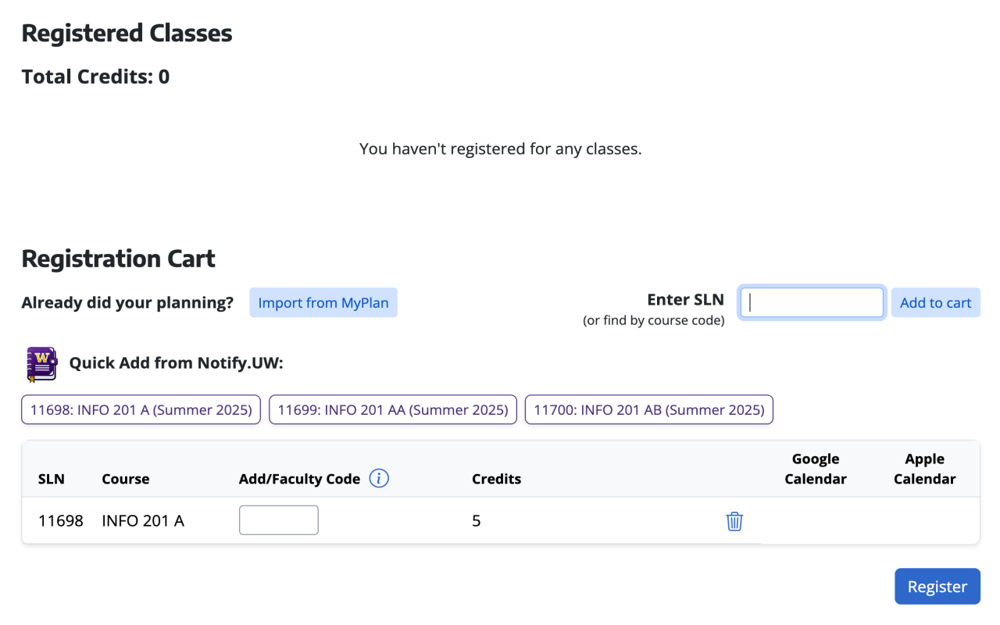
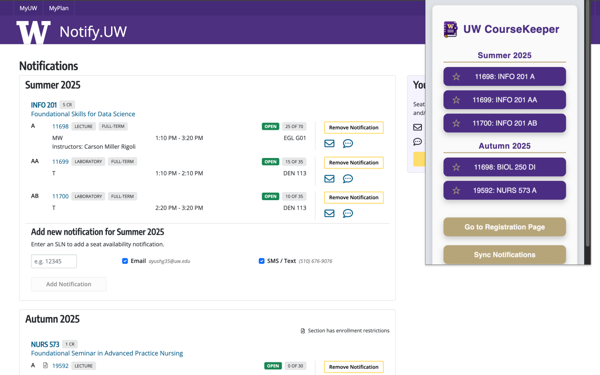

# UW CourseKeeper Extension 🎓

  
  

### Simplify Course Registration with Just One Click!

Tired of typing SLN codes only to find out you entered the wrong one or that the class filled up in the meantime? The **UW CourseKeeper Extension** is here to help. This Chrome extension integrates seamlessly with **MyPlan** and **Notify.UW**, giving you immediate access to your saved SLN codes—so you never lose time or make errors during registration again.

No more searching through different tabs to find the SLN codes! Your saved courses now show up as clean, clickable buttons directly on the registration page — synced with your MyPlan and Notify.UW data — so you can grab that spot in your desired class instantly.

This tool is **non-profit** and designed with students in mind, making the registration process more efficient and user-friendly.

### Features ✨

- **SLN Sync**: Automatically sync your saved SLN codes between **MyPlan**, **Notify.UW**, and the extension 📒
- **Quick-Add Buttons**: Instantly register by clicking course buttons injected above the cart — no typing, just click! ☑️
- **Prioritize Courses**: Organize and prioritize your SLN codes in the Chrome extension popup for quick reference ⭐️
- **Real-Time Updates**: Stay updated with course availability through direct integration with **Notify.UW** 🔄
- **Error-Free Registration**: Prevent misentering SLN codes by copying them directly from the extension 🛑

### Chrome Web Store Installation ⚙️

#### One-Click Download [Here](https://chromewebstore.google.com/detail/uw-coursekeeper/ipdnhklbnjilkkcdlfneldhmgpbjmimf?authuser=0&hl=en)!

### Privacy & Data Collection 🔐

This extension **does not collect or store any personal data**. It only accesses publicly available SLN information and syncs it across **MyPlan** and **Notify.UW** to assist students with registration. No user data is transmitted to any external server.

### Contributions 🤝

Contributions, bug reports, and feature requests are welcome! Feel free to check the [issues page](https://github.com/your-username/uw-coursekeeper-extension/issues) if you find any bugs or have suggestions.

1. Fork this repository.
2. Create a branch: `git checkout -b feature/your-feature-name`.
3. Submit a pull request detailing the changes.

### License

[MIT License](LICENSE)

---

This extension is **independently developed** and is **not affiliated with or endorsed by**:
- **University of Washington**
- **MyPlan**
- **Notify.UW**

It is a non-profit tool designed purely for educational purposes to help students make better academic decisions 📘.

# Privacy Policy 🛡️

### UW CourseKeeper Extension

_Last updated: [Date]_

The **UW CourseKeeper Extension** ("we", "our", or "the extension") does not collect, store, or share any personal data from users. The extension solely interacts with publicly available SLN codes and syncs them across **MyPlan** and **Notify.UW** to assist students in course registration. Below is more detail on how we handle your data:

### 1. **Data Collection** 
- **No Personal Data**: This extension does not collect, store, or transmit any personally identifiable information, financial data, or communication records.
- **No User Activity Tracking**: The extension does not track user activity or web history beyond its intended function on the **MyPlan** platform.

### 2. **Permissions** 
The extension requires the following permissions:
- **storage**: To store SLN codes even after the user closes the tab, ensuring constant synchronization no matter when the user opens the registration site.

These permissions are used solely to enhance the user experience by managing SLN codes while using **MyPlan**. No other sites or personal data are accessed.

### 3. **Data Sharing** 
This extension does not share any user data with third parties. It only syncs publicly available SLN codes from **MyPlan** and **Notify.UW**.

### 4. **External Links** 
The extension may include links to **Notify.UW** to help users track course availability. These external sites are governed by their own privacy policies, and we encourage users to review them.

### 5. **Changes to This Privacy Policy** 
We reserve the right to update this privacy policy at any time. Any changes will be reflected on this GitHub repository.

### 6. **Contact** 
If you have any questions regarding this privacy policy, please contact us via the repository's issue page.
